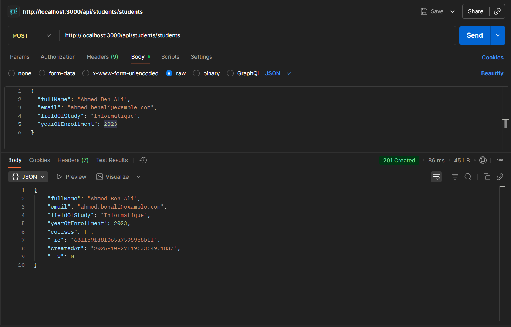
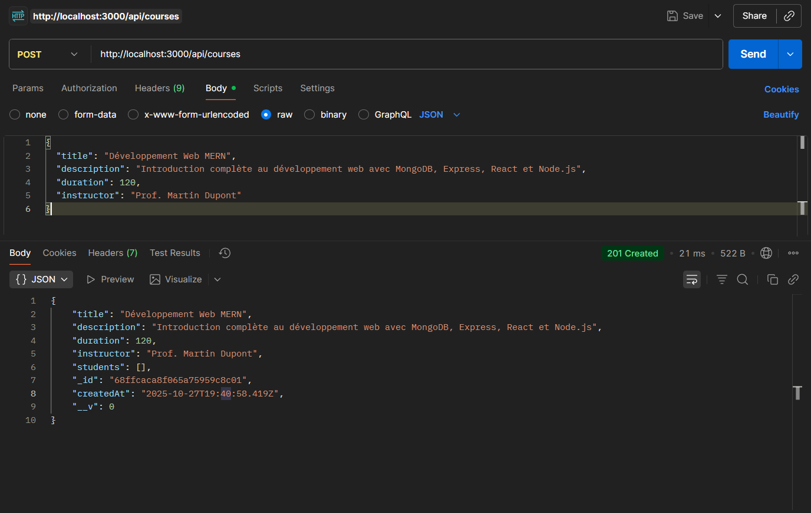
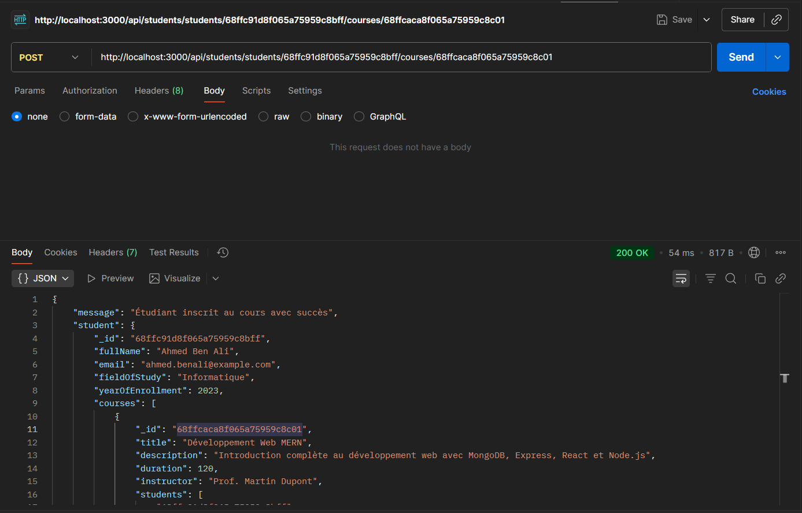
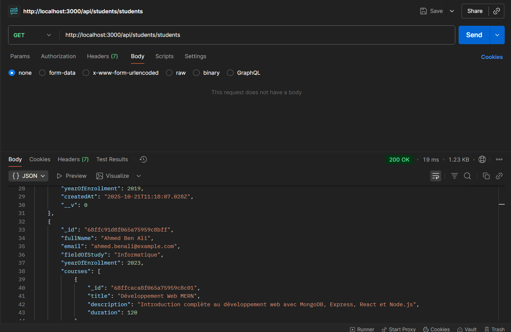
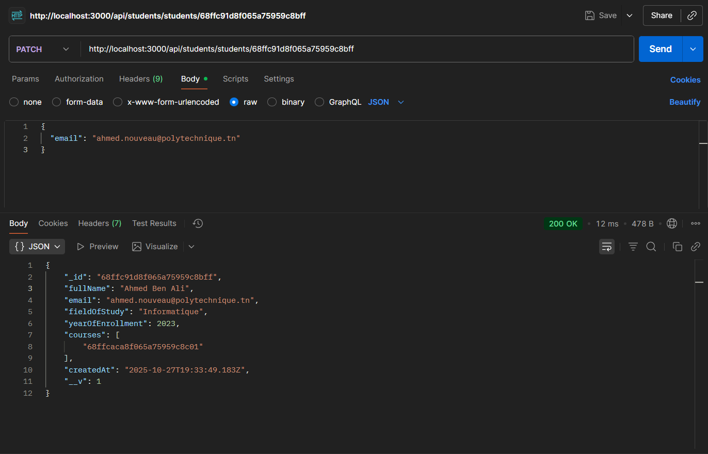
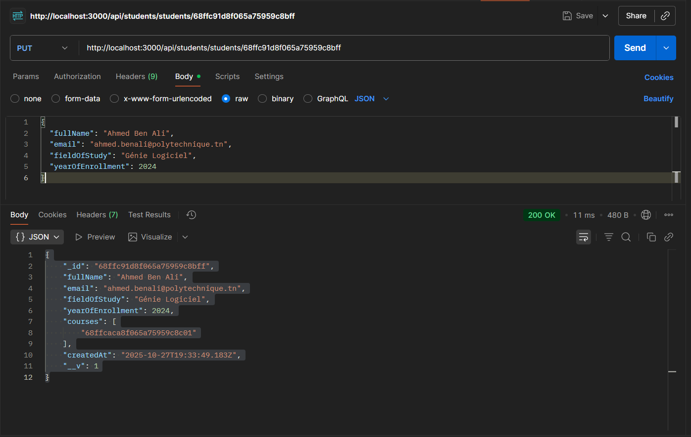
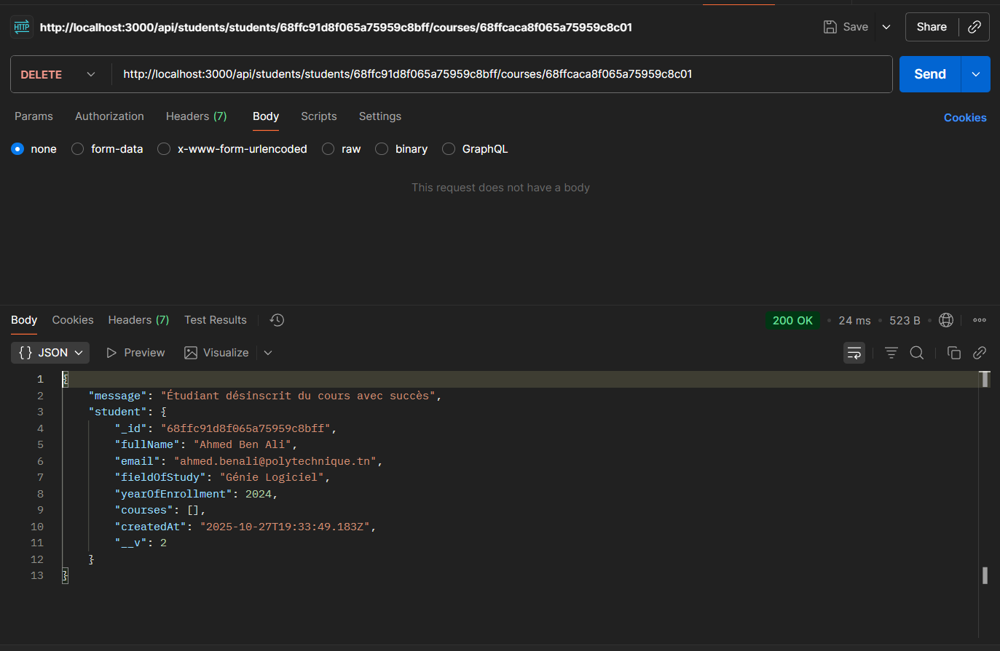
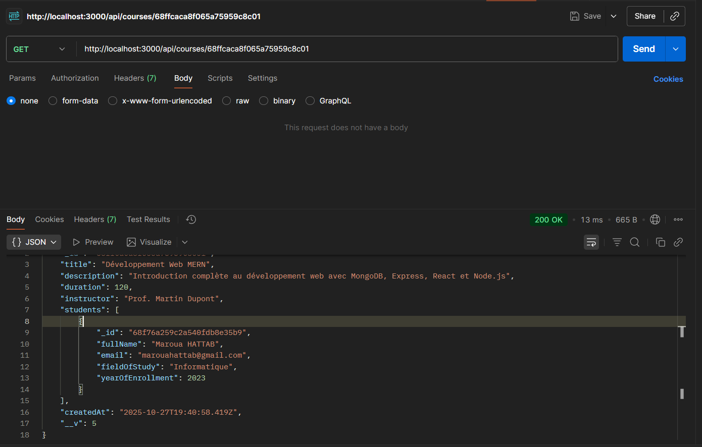
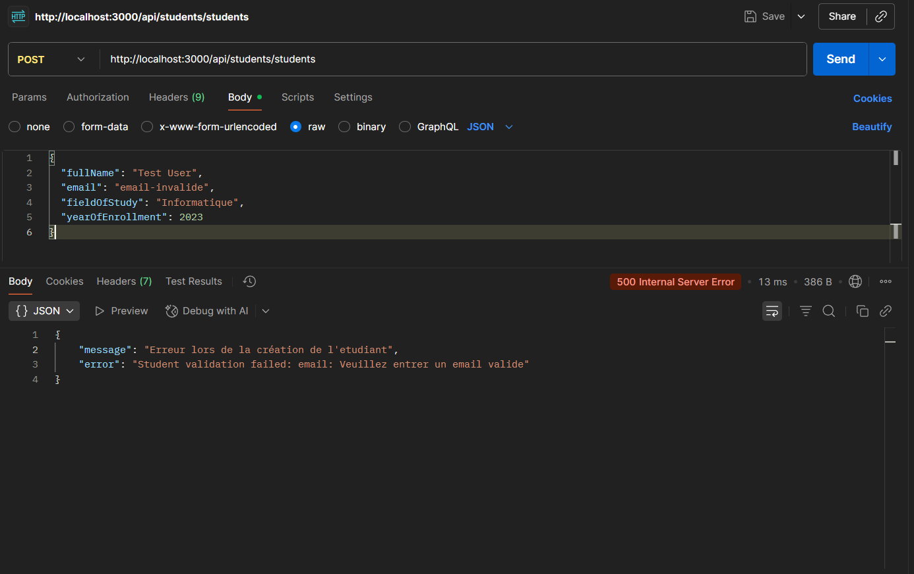

# 🎓 API Gestion Étudiants et Cours - Projet MERN


Une API REST complète pour gérer des étudiants et des cours avec une relation **Many-to-Many**, construite avec Express.js et **MongoDB/Mongoose**, en utilisant le pattern MVC (Model-View-Controller).

## 📚 Table des Matières

- [Introduction](#introduction)
- [Architecture MVC avec MongoDB](#architecture-mvc-avec-mongodb)
- [Structure du Projet](#structure-du-projet)
- [Installation](#installation)
- [Configuration](#configuration)
- [Modèles de Données](#modèles-de-données)
- [Relations Many-to-Many](#relations-many-to-many)
- [Endpoints de l'API](#endpoints-de-lapi)
- [Différence entre PUT et PATCH](#différence-entre-put-et-patch)
- [Tests avec Postman](#tests-avec-postman)
- [Technologies Utilisées](#technologies-utilisées)
- [Concepts Clés](#concepts-clés)

## 🎯 Introduction

Ce projet est une API REST développée dans le cadre du projet MERN. L'objectif principal est de créer un système de gestion d'étudiants et de cours avec :

- ✅ **Gestion complète des étudiants** (CRUD)
- ✅ **Gestion complète des cours** (CRUD)
- ✅ **Relation Many-to-Many** (un étudiant peut suivre plusieurs cours, un cours peut avoir plusieurs étudiants)
- ✅ **Inscription/Désinscription** d'étudiants aux cours
- ✅ **Validation avancée** des données avec Mongoose
- ✅ **Distinction PUT vs PATCH** pour les mises à jour

## 🏗️ Architecture MVC avec MongoDB

Notre application suit une architecture **MVC complète à 4 couches** :

```
┌─────────────────────────────────────────────────┐
│           server.js (Couche 1)                  │
│  - Configuration Express                        │
│  - Middlewares globaux                          │
│  - Connexion à MongoDB                          │
│  - Montage des routes                           │
└───────────────────┬─────────────────────────────┘
                    │
                    ▼
┌─────────────────────────────────────────────────┐
│         Routes Layer (Couche 2)                 │
│  - StudentRoutes.js                             │
│  - CourseRoutes.js                              │
│  - Définition des endpoints HTTP                │
│  - Mapping URL → Controller                     │
└───────────────────┬─────────────────────────────┘
                    │
                    ▼
┌─────────────────────────────────────────────────┐
│       Controllers Layer (Couche 3)              │
│  - studentControllers.js                        │
│  - courseController.js                          │
│  - Logique métier                               │
│  - Appels aux modèles                           │
│  - Gestion des réponses HTTP                    │
└───────────────────┬─────────────────────────────┘
                    │
                    ▼
┌─────────────────────────────────────────────────┐
│         Models Layer (Couche 4)                 │
│  - Student.js (Schéma Mongoose)                 │
│  - Course.js (Schéma Mongoose)                  │
│  - Définition des structures de données         │
│  - Relations Many-to-Many                       │
│  - Validation automatique                       │
│  - Interaction avec MongoDB                     │
└───────────────────┬─────────────────────────────┘
                    │
                    ▼
┌─────────────────────────────────────────────────┐
│              MongoDB Database                   │
│  - Collection: students                         │
│  - Collection: courses                          │
│  - Persistance des données                      │
│  - Relations bidirectionnelles                  │
└─────────────────────────────────────────────────┘
```

### Flux de Données Complet

#### 📥 **Inscription d'un Étudiant à un Cours**

```
1. Client (Postman)
   POST /api/students/students/{studentId}/courses/{courseId}
        │
        ▼
2. server.js
   └─ Route /api/students → studentRoutes
        │
        ▼
3. StudentRoutes.js
   └─ POST /students/:studentId/courses/:courseId → enrollStudentInCourse
        │
        ▼
4. studentControllers.js (enrollStudentInCourse)
   ├─ Recherche de l'étudiant dans MongoDB
   ├─ Recherche du cours dans MongoDB
   ├─ Vérification si déjà inscrit
   ├─ Ajout du courseId dans student.courses[]
   ├─ Ajout du studentId dans course.students[]
   ├─ Sauvegarde des deux documents
   └─ Populate des cours pour la réponse
        │
        ▼
5. MongoDB
   ├─ Mise à jour de la collection 'students'
   └─ Mise à jour de la collection 'courses'
        │
        ▼
6. Réponse au Client
   Status: 200 OK
   Body: { "message": "Étudiant inscrit au cours avec succès", ... }
```

## 📁 Structure du Projet

```
Projet-MERN/
│
├── 📄 server.js                        # Point d'entrée + connexion MongoDB
├── 📄 package.json                     # Dépendances (Express, Mongoose, etc.)
├── 📄 .env                             # Variables d'environnement (MongoDB URI)
├── 📄 README.md                        # Documentation complète
│
├── 📁 config/                          # Configuration
│   └── db.js                           # Connexion à MongoDB
│
├── 📁 models/                          # Modèles Mongoose avec relations
│   ├── Student.js                      # Schéma Student + relation courses[]
│   └── Course.js                       # Schéma Course + relation students[]
│
├── 📁 controllers/                     # Logique métier
│   ├── studentControllers.js           # CRUD + Inscription/Désinscription
│   └── courseController.js             # CRUD Courses avec populate
│
└── 📁 routes/                          # Définition des routes
    ├── StudentRoutes.js                # Routes étudiants + inscriptions
    └── CourseRoutes.js                 # Routes cours
```

## 🚀 Installation

### Prérequis

- **Node.js** (v14 ou supérieur)
- **MongoDB** (local ou MongoDB Atlas)
- **npm** ou **yarn**
- **Postman** (pour tester l'API)

### Étapes d'Installation

1. **Cloner ou naviguer vers le projet**

```bash
cd "c:\Users\MSI\Desktop\MERN poly\Projet-MERN"
```

2. **Installer les dépendances**

```bash
npm install
```

3. **Configurer les variables d'environnement**

Créer un fichier `.env` à la racine du projet :

```env
PORT=3000
MONGODB_URI=mongodb://localhost:27017/students-courses-db
# OU pour MongoDB Atlas :
# MONGODB_URI=mongodb+srv://<username>:<password>@cluster.mongodb.net/students-courses-db
```

4. **Lancer le serveur**

```bash
npm start
```

Le serveur démarre sur `http://localhost:3000` et se connecte à MongoDB.

## ⚙️ Configuration

### 📝 Fichier `.env`

```env
# Port du serveur
PORT=3000

# URI de connexion à MongoDB
MONGODB_URI=mongodb://localhost:27017/students-courses-db
```

### 🔌 Connexion MongoDB (`config/db.js`)

```javascript
const mongoose = require("mongoose");

const connectDB = async () => {
  try {
    await mongoose.connect(process.env.MONGODB_URI);
    console.log("✅ Connexion à MongoDB réussie !");
  } catch (err) {
    console.error("❌ Erreur de connexion à MongoDB", err.message);
    process.exit(1);
  }
};

module.exports = connectDB;
```

**Points clés :**

- ✅ Utilisation de `async/await` pour gérer la promesse
- ✅ Gestion d'erreurs avec `try/catch`
- ✅ Arrêt du processus en cas d'échec (`process.exit(1)`)

## 📋 Modèles de Données

### 👨‍🎓 Student Schema

```javascript
const studentSchema = new mongoose.Schema({
  fullName: {
    type: String,
    required: [true, "Le nom est obligatoire"],
    minLength: [9, "Le nom doit contenir au moins 9 caractères"],
  },
  email: {
    type: String,
    required: [true, "L'email est obligatoire"],
    unique: true,
    trim: true,
    lowercase: true,
    match: [
      /^\w+([.-]?\w+)*@\w+([.-]?\w+)*(\.\w{2,3})+$/,
      "Veuillez entrer un email valide",
    ],
  },
  fieldOfStudy: {
    type: String,
    required: [true, "Le domaine d'étude est obligatoire"],
  },
  yearOfEnrollment: {
    type: Number,
    required: [true, "L'année d'inscription est obligatoire"],
    min: [2011, "L'année d'inscription doit être supérieure ou égale à 2011"],
    max: [
      new Date().getFullYear(),
      "L'année d'inscription ne peut pas être dans le futur",
    ],
  },
  courses: [
    {
      type: mongoose.Schema.Types.ObjectId,
      ref: "Course", // Relation vers Course
    },
  ],
  createdAt: {
    type: Date,
    default: Date.now,
  },
});
```

**Validations :**

- ✅ Nom : minimum 9 caractères
- ✅ Email : format valide, unique, converti en minuscules
- ✅ Année : entre 2011 et l'année actuelle
- ✅ Relation : tableau de références vers les cours

### 📚 Course Schema

```javascript
const courseSchema = new mongoose.Schema({
  title: {
    type: String,
    required: [true, "Le titre du cours est obligatoire"],
    minLength: [5, "Le titre doit contenir au moins 5 caractères"],
  },
  description: {
    type: String,
    required: [true, "La description du cours est obligatoire"],
    minLength: [20, "La description doit contenir au moins 20 caractères"],
  },
  duration: {
    type: Number,
    required: [true, "La durée du cours est obligatoire"],
    min: [1, "La durée doit être d'au moins 1 minute"],
  },
  instructor: {
    type: String,
    required: [true, "Le nom de l'instructeur est obligatoire"],
  },
  students: [
    {
      type: mongoose.Schema.Types.ObjectId,
      ref: "Student", // Relation vers Student
    },
  ],
  createdAt: {
    type: Date,
    default: Date.now,
  },
});
```

**Validations :**

- ✅ Titre : minimum 5 caractères
- ✅ Description : minimum 20 caractères
- ✅ Durée : minimum 1 minute
- ✅ Relation : tableau de références vers les étudiants

## 🔗 Relations Many-to-Many

### Concept

Dans ce projet, nous avons une relation **bidirectionnelle** :

```
Student (1) ←→ (N) Course
    ↓                ↓
courses[]        students[]
```

- Un **étudiant** peut suivre **plusieurs cours** → `student.courses[]`
- Un **cours** peut avoir **plusieurs étudiants** → `course.students[]`

### Implémentation

#### 📝 Inscription (Ajout de la relation)

```javascript
// studentControllers.js - enrollStudentInCourse
student.courses.push(courseId); // Ajouter le cours à l'étudiant
course.students.push(studentId); // Ajouter l'étudiant au cours

await student.save();
await course.save();
```

#### 🗑️ Désinscription (Suppression de la relation)

```javascript
// studentControllers.js - unenrollStudentFromCourse
student.courses = student.courses.filter((id) => id.toString() !== courseId);
course.students = course.students.filter((id) => id.toString() !== studentId);

await student.save();
await course.save();
```

#### 🔍 Populate (Récupération des données liées)

```javascript
// Récupérer un étudiant avec ses cours
const student = await Student.findById(id).populate(
  "courses",
  "title description duration instructor"
);

// Récupérer un cours avec ses étudiants
const course = await Course.findById(id).populate(
  "students",
  "fullName email fieldOfStudy"
);
```

## 🔌 Endpoints de l'API

### 👨‍🎓 Étudiants

#### GET `/api/students/students`

- **Description** : Récupérer tous les étudiants avec leurs cours
- **Réponse** : Array d'étudiants avec `.populate('courses')`

```json
[
  {
    "_id": "670f1234567890abcdef1234",
    "fullName": "Ahmed Ben Ali",
    "email": "ahmed.benali@example.com",
    "fieldOfStudy": "Informatique",
    "yearOfEnrollment": 2023,
    "courses": [
      {
        "_id": "670f9876543210fedcba9876",
        "title": "Développement Web",
        "description": "Introduction au développement web moderne",
        "duration": 120
      }
    ],
    "createdAt": "2024-10-15T10:30:00.000Z"
  }
]
```

#### GET `/api/students/students/:id`

- **Description** : Récupérer un étudiant par ID avec ses cours complets
- **Réponse** : Objet étudiant avec `.populate('courses', 'title description duration instructor')`

#### POST `/api/students/students`

- **Description** : Créer un nouvel étudiant
- **Body** :

```json
{
  "fullName": "Ahmed Ben Ali",
  "email": "ahmed.benali@example.com",
  "fieldOfStudy": "Informatique",
  "yearOfEnrollment": 2023
}
```

- **Réponse** : Status 201 + Étudiant créé

#### PATCH `/api/students/students/:id`

- **Description** : Mise à jour **partielle** d'un étudiant
- **Body** : Seuls les champs à modifier

```json
{
  "email": "ahmed.nouveau@example.com"
}
```

- **Réponse** : Status 200 + Étudiant mis à jour

#### PUT `/api/students/students/:id`

- **Description** : Remplacement **complet** d'un étudiant
- **Body** : **TOUS** les champs requis

```json
{
  "fullName": "Ahmed Ben Ali",
  "email": "ahmed.complet@example.com",
  "fieldOfStudy": "Génie Logiciel",
  "yearOfEnrollment": 2024
}
```

- **Réponse** : Status 200 + Étudiant remplacé
- **Erreur** : Status 400 si un champ manque

#### DELETE `/api/students/students/:id`

- **Description** : Supprimer un étudiant
- **Réponse** : Status 204 (No Content)

#### POST `/api/students/students/:studentId/courses/:courseId`

- **Description** : Inscrire un étudiant à un cours
- **Réponse** : Status 200 + Message de succès + Étudiant avec cours

```json
{
  "message": "Étudiant inscrit au cours avec succès",
  "student": {
    "_id": "670f1234567890abcdef1234",
    "fullName": "Ahmed Ben Ali",
    "courses": [...]
  }
}
```

**Validations :**

- ❌ Étudiant non trouvé → Status 404
- ❌ Cours non trouvé → Status 404
- ❌ Déjà inscrit → Status 400

#### DELETE `/api/students/students/:studentId/courses/:courseId`

- **Description** : Désinscrire un étudiant d'un cours
- **Réponse** : Status 200 + Message de succès

---

### 📚 Cours

#### GET `/api/courses`

- **Description** : Récupérer tous les cours avec leurs étudiants
- **Réponse** : Array de cours avec `.populate('students')`

```json
[
  {
    "_id": "670f9876543210fedcba9876",
    "title": "Développement Web",
    "description": "Introduction au développement web moderne avec MERN Stack",
    "duration": 120,
    "instructor": "Prof. Martin",
    "students": [
      {
        "_id": "670f1234567890abcdef1234",
        "fullName": "Ahmed Ben Ali",
        "email": "ahmed.benali@example.com",
        "fieldOfStudy": "Informatique"
      }
    ],
    "createdAt": "2024-10-10T08:00:00.000Z"
  }
]
```

#### GET `/api/courses/:id`

- **Description** : Récupérer un cours par ID avec ses étudiants
- **Réponse** : Objet cours avec `.populate('students', 'fullName email fieldOfStudy yearOfEnrollment')`

#### POST `/api/courses`

- **Description** : Créer un nouveau cours
- **Body** :

```json
{
  "title": "Développement Web",
  "description": "Introduction au développement web moderne avec MERN Stack",
  "duration": 120,
  "instructor": "Prof. Martin"
}
```

- **Réponse** : Status 201 + Cours créé

#### PATCH `/api/courses/:id`

- **Description** : Mise à jour **partielle** d'un cours
- **Body** : Seuls les champs à modifier

```json
{
  "duration": 150
}
```

#### PUT `/api/courses/:id`

- **Description** : Remplacement **complet** d'un cours
- **Body** : **TOUS** les champs requis

```json
{
  "title": "Développement Web Avancé",
  "description": "Cours avancé sur le développement web full-stack",
  "duration": 180,
  "instructor": "Prof. Martin"
}
```

#### DELETE `/api/courses/:id`

- **Description** : Supprimer un cours
- **Action automatique** : Retire le cours de tous les étudiants inscrits
- **Réponse** : Status 200 + Message de succès

```javascript
// Logique de suppression avec nettoyage des relations
await Student.updateMany(
  { courses: req.params.id },
  { $pull: { courses: req.params.id } }
);
```

## 🔄 Différence entre PUT et PATCH

### 📊 Tableau Comparatif

| Aspect                  | PATCH                      | PUT                          |
| ----------------------- | -------------------------- | ---------------------------- |
| **Type de mise à jour** | Partielle                  | Complète (remplacement)      |
| **Champs requis**       | Seulement ceux à modifier  | TOUS les champs obligatoires |
| **Comportement**        | Modifie les champs fournis | Remplace tout l'objet        |
| **Validation**          | Sur les champs fournis     | Sur TOUS les champs          |
| **Utilisation**         | Modifier un ou deux champs | Remplacer entièrement        |

### 💡 Exemples Pratiques

#### ✅ PATCH - Mise à jour Partielle

**Requête :**

```http
PATCH /api/students/students/670f1234567890abcdef1234
Content-Type: application/json

{
  "email": "ahmed.nouveau@example.com"
}
```

**Code Controller :**

```javascript
const updateStudent = async (req, res) => {
  const updatedStudent = await Student.findByIdAndUpdate(
    req.params.id,
    req.body, // Seuls les champs fournis
    { new: true, runValidators: true }
  );
  res.status(200).json(updatedStudent);
};
```

**Résultat :**

- ✅ Email mis à jour
- ✅ Autres champs inchangés

---

#### ✅ PUT - Remplacement Complet

**Requête :**

```http
PUT /api/students/students/670f1234567890abcdef1234
Content-Type: application/json

{
  "fullName": "Ahmed Ben Ali",
  "email": "ahmed.complet@example.com",
  "fieldOfStudy": "Génie Logiciel",
  "yearOfEnrollment": 2024
}
```

**Code Controller :**

```javascript
const replaceStudent = async (req, res) => {
  const { fullName, email, fieldOfStudy, yearOfEnrollment } = req.body;

  // Vérification que TOUS les champs sont présents
  if (!fullName || !email || !fieldOfStudy || !yearOfEnrollment) {
    return res.status(400).json({
      message: "Tous les champs sont requis pour PUT",
    });
  }

  const replacedStudent = await Student.findByIdAndUpdate(
    req.params.id,
    { fullName, email, fieldOfStudy, yearOfEnrollment },
    { new: true, runValidators: true, overwrite: true }
  );

  res.status(200).json(replacedStudent);
};
```

**Résultat :**

- ✅ Tous les champs remplacés
- ❌ Erreur 400 si un champ manque

---

#### ❌ PUT avec Champs Manquants

**Requête incorrecte :**

```http
PUT /api/students/students/670f1234567890abcdef1234
Content-Type: application/json

{
  "email": "ahmed.nouveau@example.com"
}
```

**Réponse d'erreur :**

```json
{
  "message": "Tous les champs sont requis pour PUT (fullName, email, fieldOfStudy, yearOfEnrollment)"
}
```

## 🧪 Tests avec Postman

### 1. Créer un Étudiant

**POST** `http://localhost:3000/api/students/students`

**Body :**

```json
{
  "fullName": "Ahmed Ben Ali",
  "email": "ahmed.benali@example.com",
  "fieldOfStudy": "Informatique",
  "yearOfEnrollment": 2023
}
```

**Réponse attendue (201) :**

```json
{
  "fullName": "Ahmed Ben Ali",
  "email": "ahmed.benali@example.com",
  "fieldOfStudy": "Informatique",
  "yearOfEnrollment": 2023,
  "courses": [],
  "_id": "68ffc91d8f065a75959c8bff",
  "createdAt": "2025-10-27T19:33:49.183Z",
  "__v": 0
}
```

## 

### 2. Créer un Cours

**POST** `http://localhost:3000/api/courses`

**Body :**

```json
{
  "title": "Développement Web MERN",
  "description": "Introduction complète au développement web avec MongoDB, Express, React et Node.js",
  "duration": 120,
  "instructor": "Prof. Martin Dupont"
}
```

**Réponse attendue (201) :**

```json
{
  "title": "Développement Web MERN",
  "description": "Introduction complète au développement web avec MongoDB, Express, React et Node.js",
  "duration": 120,
  "instructor": "Prof. Martin Dupont",
  "students": [],
  "_id": "68ffcaca8f065a75959c8c01",
  "createdAt": "2025-10-27T19:40:58.419Z",
  "__v": 0
}
```

## 

### 3. Inscrire un Étudiant à un Cours

**POST** `http://localhost:3000/api/students/students/68ffc91d8f065a75959c8bff/courses/68ffcaca8f065a75959c8c01`

**Note :** Les IDs de l'étudiant et du cours sont passés dans l'URL (pas de body requis)

**Réponse attendue (200) :**

```json
{
  "message": "Étudiant inscrit au cours avec succès",
  "student": {
    "_id": "68ffc91d8f065a75959c8bff",
    "fullName": "Ahmed Ben Ali",
    "email": "ahmed.benali@example.com",
    "fieldOfStudy": "Informatique",
    "yearOfEnrollment": 2023,
    "courses": [
      {
        "_id": "68ffcaca8f065a75959c8c01",
        "title": "Développement Web MERN",
        "description": "Introduction complète au développement web avec MongoDB, Express, React et Node.js",
        "duration": 120,
        "instructor": "Prof. Martin Dupont",
        "students": ["68ffc91d8f065a75959c8bff"],
        "createdAt": "2025-10-27T19:40:58.419Z",
        "__v": 1
      }
    ],
    "createdAt": "2025-10-27T19:33:49.183Z",
    "__v": 1
  }
}
```



````

---

### 4. Récupérer Tous les Étudiants avec Leurs Cours

**GET** `http://localhost:3000/api/students/students`

**Réponse attendue (200) :**

```json
[
  {
        "_id": "68ffc91d8f065a75959c8bff",
        "fullName": "Ahmed Ben Ali",
        "email": "ahmed.benali@example.com",
        "fieldOfStudy": "Informatique",
        "yearOfEnrollment": 2023,
        "courses": [
            {
                "_id": "68ffcaca8f065a75959c8c01",
                "title": "Développement Web MERN",
                "description": "Introduction complète au développement web avec MongoDB, Express, React et Node.js",
                "duration": 120
            }
        ],
        "createdAt": "2025-10-27T19:33:49.183Z",
        "__v": 1
    }
]
````

## 

### 5. Mise à Jour Partielle (PATCH)

**PATCH** `http://localhost:3000/api/students/students/68ffc91d8f065a75959c8bff`

**Body :**

```json
{
  "email": "ahmed.nouveau@polytechnique.tn"
}
```

**Résultat :** Seul l'email est modifié ✅

---



### 6. Remplacement Complet (PUT)

**PUT** `http://localhost:3000/api/students/students/68ffc91d8f065a75959c8bff`

**Body :**

```json
{
  "fullName": "Ahmed Ben Ali",
  "email": "ahmed.benali@polytechnique.tn",
  "fieldOfStudy": "Génie Logiciel",
  "yearOfEnrollment": 2024
}
```

**Résultat :** Tous les champs sont remplacés ✅

---



### 7. Désinscrire un Étudiant d'un Cours

**DELETE** `http://localhost:3000/api/students/students/68ffc91d8f065a75959c8bff/courses/68ffcaca8f065a75959c8c01`

**Réponse attendue (200) :**

```json
{
  "message": "Étudiant désinscrit du cours avec succès",
  "student": {
    "_id": "68ffc91d8f065a75959c8bff",
    "fullName": "Ahmed Ben Ali",
    "email": "ahmed.benali@polytechnique.tn",
    "fieldOfStudy": "Génie Logiciel",
    "yearOfEnrollment": 2024,
    "courses": [],
    "createdAt": "2025-10-27T19:33:49.183Z",
    "__v": 2
  }
}
```

---



### 8. Récupérer un Cours avec Ses Étudiants

**GET** `http://localhost:3000/api/courses/68ffcaca8f065a75959c8c01`

**Réponse attendue (200) :**

```json
{
  "_id": "68ffcaca8f065a75959c8c01",
  "title": "Développement Web MERN",
  "description": "Introduction complète au développement web avec MongoDB, Express, React et Node.js",
  "duration": 120,
  "instructor": "Prof. Martin Dupont",
  "students": [
    {
      "_id": "68f76a259c2a540fdb8e35b9",
      "fullName": "Maroua HATTAB",
      "email": "marouahattab@gmail.com",
      "fieldOfStudy": "Informatique",
      "yearOfEnrollment": 2023
    }
  ],
  "createdAt": "2025-10-27T19:40:58.419Z",
  "__v": 5
}
```

---



### 9. Test de Validation - Étudiant Invalide

**POST** `http://localhost:3000/api/students/students`

**Body (email invalide) :**

```json
{
  "fullName": "Test User",
  "email": "email-invalide",
  "fieldOfStudy": "Informatique",
  "yearOfEnrollment": 2023
}
```

**Réponse d'erreur (500) :**

```json
{
  "message": "Erreur lors de la création de l'etudiant",
  "error": "Student validation failed: email: Veuillez entrer un email valide"
}
```

## !

### 10. Test - Inscription Double (Déjà Inscrit)

**POST** `http://localhost:3000/api/students/students/{studentId}/courses/{courseId}` (2ème fois)

**Réponse d'erreur (400) :**

```json
{
  "message": "L'étudiant est déjà inscrit à ce cours"
}
```


## 🛠️ Technologies Utilisées

- **Node.js** - Environnement d'exécution JavaScript côté serveur
- **Express.js** - Framework web minimaliste et flexible
- **MongoDB** - Base de données NoSQL orientée documents
- **Mongoose** - ODM (Object Document Mapper) pour MongoDB
- **dotenv** - Gestion des variables d'environnement
- **Postman** - Tests et documentation d'API

## 🎓 Concepts Clés Appris

### 1. **Relations Many-to-Many avec Mongoose**

```javascript
// Référence bidirectionnelle
Student: {
  courses: [{ type: ObjectId, ref: "Course" }];
}
Course: {
  students: [{ type: ObjectId, ref: "Student" }];
}
```

**Avantages :**

- 🔗 Relations bidirectionnelles maintenues
- 🔍 Population facile avec `.populate()`
- 🔄 Synchronisation automatique

### 2. **Populate pour Charger les Relations**

```javascript
// Au lieu de récupérer juste les IDs
const student = await Student.findById(id).populate("courses");

// Sélection de champs spécifiques
const student = await Student.findById(id).populate(
  "courses",
  "title description duration instructor"
);
```

### 3. **Distinction PUT vs PATCH**

| Méthode | Sémantique HTTP | Validation      | Cas d'usage           |
| ------- | --------------- | --------------- | --------------------- |
| PATCH   | Modification    | Champs fournis  | Modifier 1-2 champs   |
| PUT     | Remplacement    | Tous les champs | Remplacer entièrement |

### 4. **Validation Avancée avec Mongoose**

```javascript
email: {
    type: String,
    required: [true, 'Message personnalisé'],
    unique: true,
    lowercase: true,
    match: [/regex/, 'Message d\'erreur']
}
```

### 5. **Gestion des Relations lors de la Suppression**

```javascript
// Suppression en cascade
await Student.updateMany(
  { courses: courseId },
  { $pull: { courses: courseId } }
);
```

### 6. **Async/Await pour Code Lisible**

```javascript
try {
  const student = await Student.findById(id);
  const course = await Course.findById(courseId);
  // Opérations...
  await student.save();
  await course.save();
} catch (error) {
  res.status(500).json({ error: error.message });
}
```

## 📊 Schéma de la Base de Données

```
┌─────────────────────────┐         ┌─────────────────────────┐
│       STUDENTS          │         │        COURSES          │
├─────────────────────────┤         ├─────────────────────────┤
│ _id: ObjectId           │◄───────►│ _id: ObjectId           │
│ fullName: String        │         │ title: String           │
│ email: String (unique)  │         │ description: String     │
│ fieldOfStudy: String    │         │ duration: Number        │
│ yearOfEnrollment: Number│         │ instructor: String      │
│ courses: [ObjectId] ────┼────┐    │ students: [ObjectId] ───┼────┐
│ createdAt: Date         │    │    │ createdAt: Date         │    │
└─────────────────────────┘    │    └─────────────────────────┘    │
                               │                                    │
                               └────────────────────────────────────┘
                              Relation Many-to-Many Bidirectionnelle
```

## 🎯 Conclusion

Ce projet **Gestion Étudiants-Cours** démontre :

- 💾 **Architecture MVC complète** avec MongoDB
- 🔗 **Relations Many-to-Many bidirectionnelles** bien implémentées
- ✅ **Validation robuste** des données avec Mongoose
- 🔄 **Distinction claire entre PUT et PATCH**
- 📋 **CRUD complet** pour deux entités liées
- 🎓 **Gestion d'inscriptions** avec validation
- 🚀 **Code production-ready** avec gestion d'erreurs

Cette API constitue une base solide pour développer un système de gestion académique complet avec la stack MERN.

---

## 📝 Auteur

Projet réalisé dans le cadre du cours MERN - Polytech

---

## 📄 License

Ce projet est sous licence MIT.
