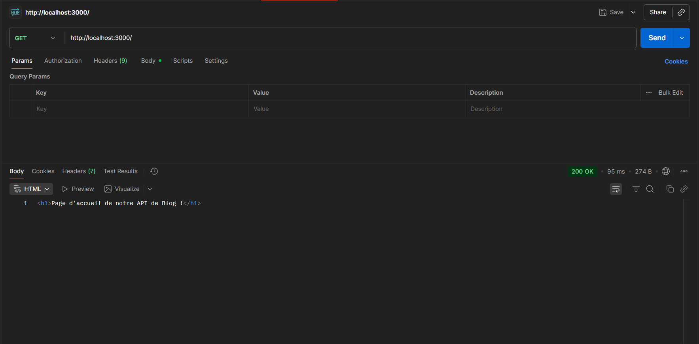
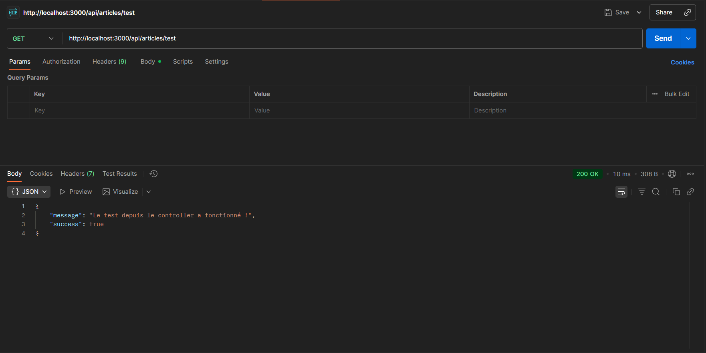
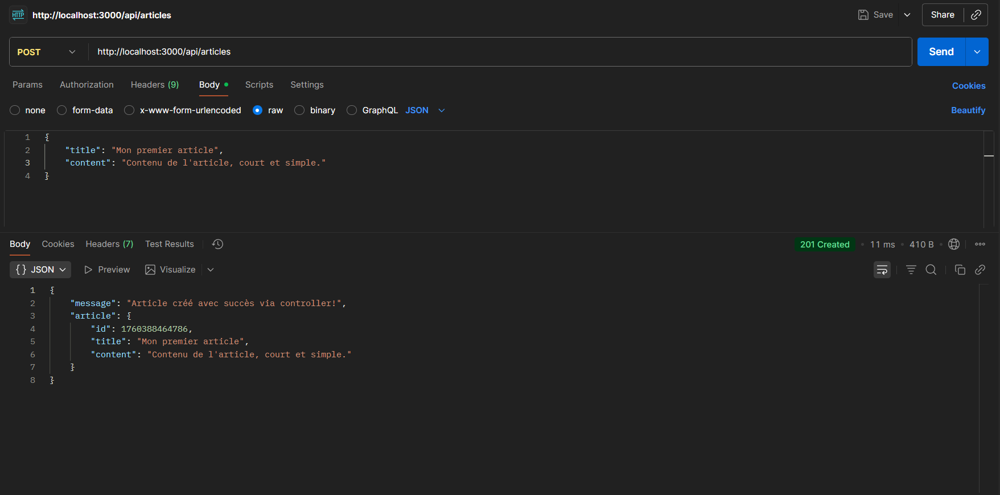

# 📝 API Blog - TP2 MERN

Une API REST simple pour gérer des articles de blog et des utilisateurs, construite avec Express.js en utilisant le pattern **Séparation des Préoccupations (SoC)**.

## 📚 Table des Matières

- [Introduction](#introduction)
- [Séparation des Préoccupations (SoC)](#séparation-des-préoccupations-soc)
- [Structure du Projet](#structure-du-projet)
- [Installation](#installation)
- [Endpoints de l'API](#endpoints-de-lapi)
- [Tests avec Postman](#tests-avec-postman)
- [Technologies Utilisées](#technologies-utilisées)

## 🎯 Introduction

Ce projet est une API REST développée dans le cadre du TP2 du cours MERN. L'objectif principal est de démontrer l'importance de la **Séparation des Préoccupations (Separation of Concerns - SoC)** dans le développement d'applications Node.js/Express.

## 🏗️ Séparation des Préoccupations (SoC)

### Qu'est-ce que la Séparation des Préoccupations ?

La **Séparation des Préoccupations** est un principe de conception logicielle qui consiste à diviser un programme en sections distinctes, où chaque section gère une préoccupation spécifique. Une "préoccupation" est un ensemble de responsabilités qui affectent le code.

### Avant vs Après

#### ❌ **Approche Monolithique (TP Précédents)**

Dans les TPs précédents, toute la logique était concentrée dans un seul fichier `server.js` :

```javascript
// server.js - TOUT dans un seul fichier
const express = require("express");
const app = express();

app.use(express.json());

// Routes + Logique métier mélangées
app.get("/api/articles/test", (req, res) => {
  res.status(200).json({ message: "Test article", success: true });
});

app.post("/api/articles", (req, res) => {
  const articleData = req.body;
  // Logique de création d'article directement ici
  res.status(201).json({
    message: "Article créé",
    article: { id: Date.now(), ...articleData },
  });
});

app.get("/api/users", (req, res) => {
  // Logique utilisateurs directement ici
  res.status(200).json({ users: [] });
});

// ... des dizaines d'autres routes ...
```

**Problèmes de cette approche :**

- 🔴 **Difficile à maintenir** : Tout est mélangé dans un seul fichier
- 🔴 **Non réutilisable** : Impossible de réutiliser la logique ailleurs
- 🔴 **Difficile à tester** : Les tests unitaires sont complexes
- 🔴 **Manque de clarté** : Difficile de comprendre la structure
- 🔴 **Collaboration difficile** : Plusieurs développeurs ne peuvent pas travailler efficacement

#### ✅ **Approche avec SoC (TP2 Actuel)**

Maintenant, le code est organisé en modules distincts avec des responsabilités claires :

```
mon-api-blog -TP2/
├── server.js              # Point d'entrée - Configuration Express
├── routes/
│   ├── articleRoutes.js   # Définition des routes articles
│   └── userRoutes.js      # Définition des routes utilisateurs
├── controllers/
│   ├── articleController.js  # Logique métier articles
│   └── userController.js     # Logique métier utilisateurs
```

**Avantages de cette approche :**

- ✅ **Maintenabilité** : Chaque fichier a une responsabilité claire
- ✅ **Réutilisabilité** : Les controllers peuvent être réutilisés
- ✅ **Testabilité** : Facile de tester chaque composant séparément
- ✅ **Lisibilité** : Structure claire et facile à comprendre
- ✅ **Scalabilité** : Facile d'ajouter de nouvelles fonctionnalités
- ✅ **Collaboration** : Plusieurs développeurs peuvent travailler simultanément

### Architecture à 3 Couches

Notre application suit une architecture à 3 couches :

```
┌─────────────────────────────────────────┐
│         server.js (Couche 1)            │
│  - Configuration Express                │
│  - Middlewares globaux                  │
│  - Montage des routes                   │
└──────────────────┬──────────────────────┘
                   │
                   ▼
┌─────────────────────────────────────────┐
│      Routes Layer (Couche 2)            │
│  - articleRoutes.js                     │
│  - userRoutes.js                        │
│  - Définition des endpoints HTTP        │
│  - Mapping URL → Controller             │
└──────────────────┬──────────────────────┘
                   │
                   ▼
┌─────────────────────────────────────────┐
│    Controllers Layer (Couche 3)         │
│  - articleController.js                 │
│  - userController.js                    │
│  - Logique métier                       │
│  - Traitement des données               │
│  - Réponses HTTP                        │
└─────────────────────────────────────────┘
```

### Exemples Concrets

#### 1️⃣ **server.js** - Configuration et Point d'entrée

```javascript
const express = require("express");
const app = express();
const articleRoutes = require("./routes/articleRoutes");
const userRoutes = require("./routes/userRoutes");

app.use(express.json());

// Montage des routes
app.use("/api/articles", articleRoutes);
app.use("/api/users", userRoutes);

app.listen(3000, () => {
  console.log("Serveur démarré sur http://localhost:3000");
});
```

**Responsabilité** : Configurer Express et monter les routes principales.

#### 2️⃣ **routes/articleRoutes.js** - Définition des Routes

```javascript
const express = require("express");
const router = express.Router();
const { TestApi, createArticle } = require("../controllers/articleController");

router.get("/test", TestApi);
router.post("/", createArticle);

module.exports = router;
```

**Responsabilité** : Définir les endpoints HTTP et les lier aux controllers appropriés.

#### 3️⃣ **controllers/articleController.js** - Logique Métier

```javascript
const TestApi = (req, res) => {
  res.status(200).json({
    message: "Le test depuis le controller a fonctionné !",
    success: true,
  });
};

const createArticle = (req, res) => {
  const articleData = req.body;
  console.log("Données reçues par le controller:", articleData);
  res.status(201).json({
    message: "Article créé avec succès via controller!",
    article: { id: Date.now(), ...articleData },
  });
};

module.exports = { TestApi, createArticle };
```

**Responsabilité** : Implémenter la logique métier et gérer les réponses.

## 📁 Structure du Projet

```
mon-api-blog -TP2/
│
├── 📄 server.js                    # Point d'entrée de l'application
├── 📄 package.json                 # Dépendances du projet
├── 📄 README.md                    # Documentation
│
├── 📁 controllers/                 # Logique métier
│   ├── articleController.js        # Gestion des articles
│   └── userController.js           # Gestion des utilisateurs
│
├── 📁 routes/                      # Définition des routes
│   ├── articleRoutes.js            # Routes pour les articles
│   └── userRoutes.js               # Routes pour les utilisateurs
│
└── 📁 img/                         # Images de tests Postman
    ├── test-article.png
    ├── create-article.png
    ├── get-users.png
    └── create-user.png
```

## 🚀 Installation

### Prérequis

- Node.js (v14 ou supérieur)
- npm ou yarn
- Postman (pour tester l'API)

### Étapes d'Installation

1. **Cloner le projet**

```bash
cd "c:\Users\MSI\Desktop\MERN poly\mon-api-blog -TP2"
```

2. **Installer les dépendances**

```bash
npm install
```

3. **Lancer le serveur en mode développement**

```bash
npm run dev
```

4. **Lancer le serveur en mode production**

```bash
npm start
```

Le serveur démarre sur `http://localhost:3000`

## 🔌 Endpoints de l'API

### Page d'Accueil

#### GET `/`

- **Description** : Page d'accueil de l'API
- **Réponse** : HTML

```
GET http://localhost:3000/
```


---

### Articles

#### GET `/api/articles/test`

- **Description** : Tester l'endpoint des articles
- **Réponse** : JSON

```json
{
  "message": "Le test depuis le controller a fonctionné !",
  "success": true
}
```



#### POST `/api/articles`

- **Description** : Créer un nouvel article
- **Body** : JSON

```json
{
  "titre": "Mon premier article",
  "contenu": "Ceci est le contenu de l'article",
}
```

- **Réponse** : JSON

```json
{
  "message": "Article créé avec succès via controller!",
  "article": {
    "id": 1697201234567,
    "titre": "Mon premier article",
    "contenu": "Ceci est le contenu de l'article"
  }
}



```

---

### Utilisateurs

#### POST `/api/users`

- **Description** : Créer un nouvel utilisateur
- **Body** : JSON

```json
{
  "name": "Ali",
  "email": "ali@example.com"
}
```

- **Réponse** : JSON

```json
{
  "message": "Utilisateur créé avec succès via controller!",
  "user": {
    "id": 1697201234567,
    "name": "Ali",
    "email": "ali@example.com"
  }
}
```


#### GET `/api/users`

- **Description** : Récupérer tous les utilisateurs
- **Réponse** : JSON

```json
{
    "message": "Récupération de tous les utilisateurs",
    "success": true,
    "users": [
        {
            "id": 1760389042017,
            "email": "Ali@example.com",
            "name": "Ali"
        },
        {
            "id": 1760389071122,
            "email": "Maroua@example.com",
            "name": "Maroua"
        },
        {
            "id": 1760389086049,
            "email": "Monjia@example.com",
            "name": "Monjia"
        }
    ]
}
```


## 🧪 Tests avec Postman

### 1. Test de l'Endpoint Articles - GET `/api/articles/test`


**Étapes :**

1. Ouvrir Postman
2. Créer une nouvelle requête GET
3. URL : `http://localhost:3000/api/articles/test`
4. Cliquer sur "Send"
5. Vérifier la réponse (Status 200)

---

### 2. Création d'un Article - POST `/api/articles`


**Étapes :**

1. Créer une nouvelle requête POST
2. URL : `http://localhost:3000/api/articles`
3. Dans l'onglet "Body" :
   - Sélectionner "raw"
   - Sélectionner "JSON"
4. Ajouter le JSON :

```json
{
   "title": "Mon premier article",
   "content": "Contenu de l'article, court et simple."
}
```

5. Cliquer sur "Send"
6. Vérifier la réponse (Status 201)

---

### 3. Récupération des Utilisateurs - GET `/api/users`


**Étapes :**

1. Créer une nouvelle requête GET
2. URL : `http://localhost:3000/api/users`
3. Cliquer sur "Send"
4. Vérifier la réponse (Status 200)

---

### 4. Création d'un Utilisateur - POST `/api/users`


**Étapes :**

1. Créer une nouvelle requête POST
2. URL : `http://localhost:3000/api/users`
3. Dans l'onglet "Body" :
   - Sélectionner "raw"
   - Sélectionner "JSON"
4. Ajouter le JSON :

```json
{
    "email": "Monjia@example.com",
    "name": "Monjia"
}
```

5. Cliquer sur "Send"
6. Vérifier la réponse (Status 201)

---

## 🛠️ Technologies Utilisées

- **Node.js** - Environnement d'exécution JavaScript
- **Express.js v5.1.0** - Framework web minimaliste
- **Nodemon v3.1.10** - Rechargement automatique du serveur en développement
- **Postman** - Tests d'API

## 📊 Comparaison des Approches

| Critère                   | Sans SoC | Avec SoC   |
| ------------------------- | -------- | ---------- |
| **Lignes dans server.js** | 100+     | ~20        |
| **Maintenabilité**        | ⭐⭐     | ⭐⭐⭐⭐⭐ |
| **Testabilité**           | ⭐⭐     | ⭐⭐⭐⭐⭐ |
| **Réutilisabilité**       | ⭐       | ⭐⭐⭐⭐⭐ |
| **Collaboration**         | ⭐⭐     | ⭐⭐⭐⭐⭐ |
| **Scalabilité**           | ⭐⭐     | ⭐⭐⭐⭐⭐ |

## 🎓 Conclusion

La **Séparation des Préoccupations** n'est pas seulement une bonne pratique, c'est une nécessité pour :

- 🚀 **Développer rapidement** : Code organisé = développement plus rapide
- 🐛 **Déboguer facilement** : Trouver et corriger les bugs devient simple
- 👥 **Collaborer efficacement** : Plusieurs personnes peuvent travailler sans conflits
- 📈 **Faire évoluer l'application** : Ajouter des fonctionnalités sans tout casser
- 🧪 **Tester systématiquement** : Tests unitaires et d'intégration simplifiés

Ce TP démontre qu'une bonne architecture, même pour une petite application, facilite grandement le développement et la maintenance du code.

---
## 📝 Auteur

Projet réalisé dans le cadre du TP2 du cours MERN - Polytech

