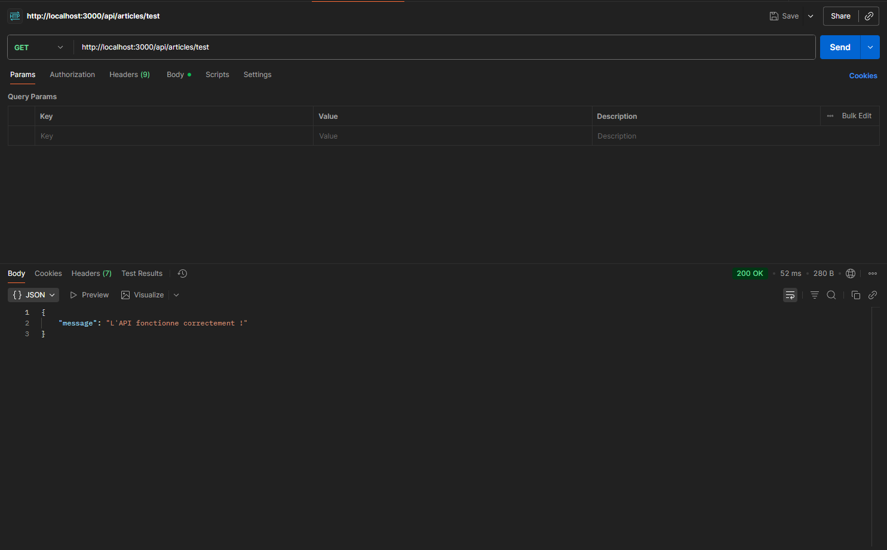
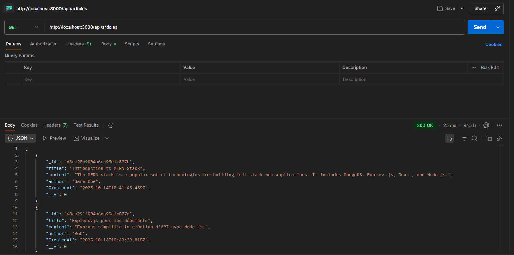
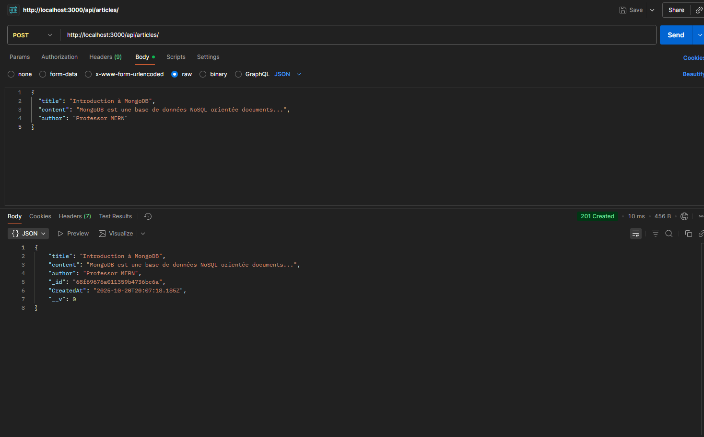
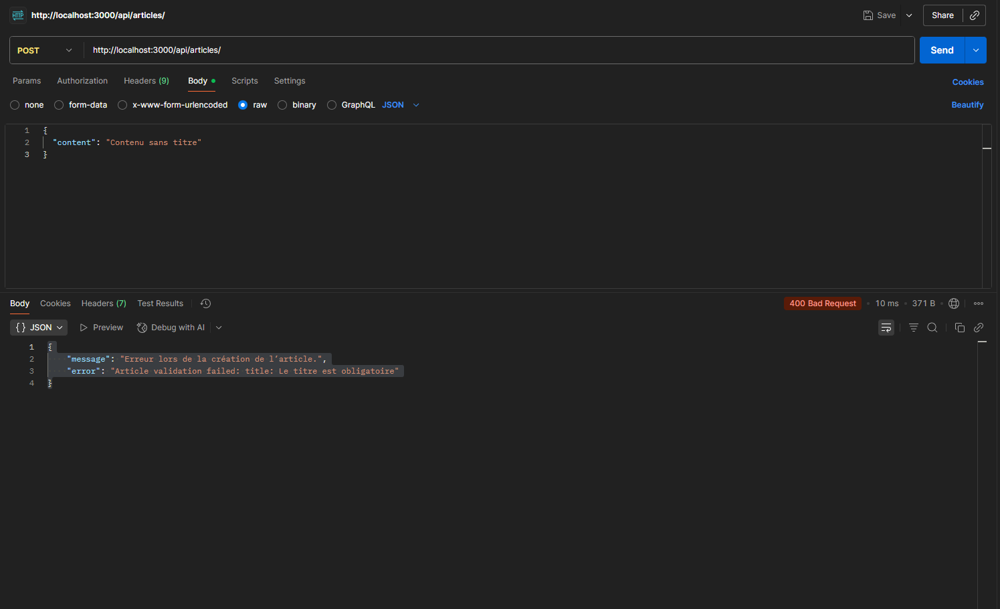
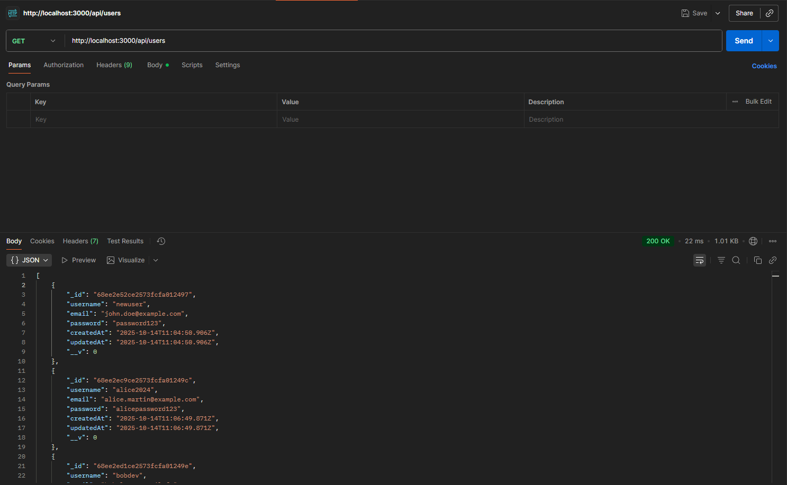
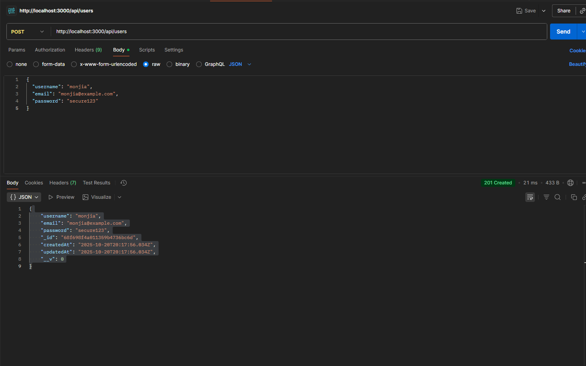
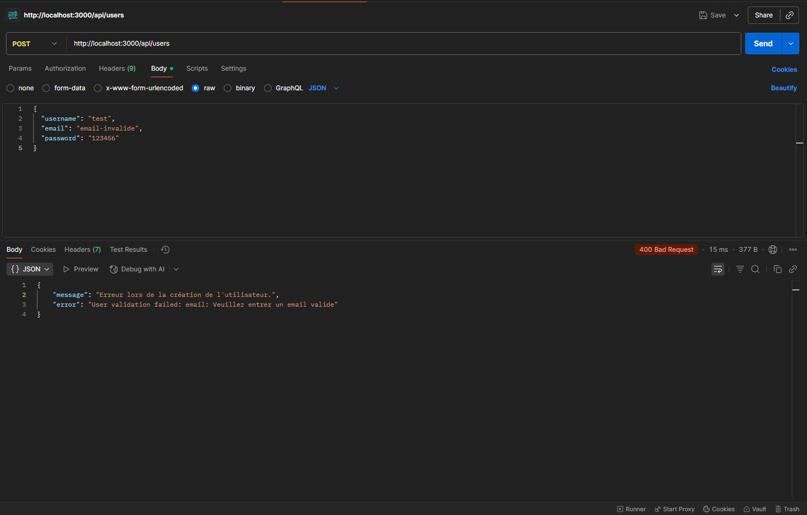

# 📝 API Blog - TP3 MERN


Une API REST complète pour gérer des articles de blog et des utilisateurs, construite avec Express.js et **MongoDB/Mongoose**, en utilisant le pattern MVC (Model-View-Controller).

## 📚 Table des Matières

- [Introduction](#introduction)
- [Évolution : Du TP2 au TP3](#évolution--du-tp2-au-tp3)
- [Architecture MVC avec MongoDB](#architecture-mvc-avec-mongodb)
- [Structure du Projet](#structure-du-projet)
- [Installation](#installation)
- [Configuration](#configuration)
- [Endpoints de l'API](#endpoints-de-lapi)
- [Tests avec Postman](#tests-avec-postman)
- [Technologies Utilisées](#technologies-utilisées)
- [Schémas de Données](#schémas-de-données)

## 🎯 Introduction

Ce projet est une API REST développée dans le cadre du TP3 du cours MERN. L'objectif principal est d'intégrer **MongoDB** comme base de données et d'utiliser **Mongoose** comme ODM (Object Document Mapper) pour gérer les données de manière structurée et efficace.

## 🚀 Évolution : Du TP2 au TP3

### 📊 Comparaison des Versions

| Aspect                 | TP2                      | TP3                          |
| ---------------------- | ------------------------ | ---------------------------- |
| **Base de données**    | ❌ Données en mémoire    | ✅ MongoDB (persistance)     |
| **Modèles de données** | ❌ Objets simples        | ✅ Schémas Mongoose          |
| **Validation**         | ❌ Manuelle              | ✅ Automatique (Mongoose)    |
| **Persistance**        | ❌ Perdue au redémarrage | ✅ Sauvegardée en BD         |
| **Configuration**      | ❌ Codée en dur          | ✅ Variables d'environnement |
| **Gestion d'erreurs**  | ⭐⭐                     | ⭐⭐⭐⭐⭐                   |

### ❌ **Avant (TP2) - Données en Mémoire**

```javascript
// controllers/articleController.js - TP2
const createArticle = (req, res) => {
  const articleData = req.body;
  // Données stockées temporairement, perdues au redémarrage
  res.status(201).json({
    message: "Article créé avec succès via controller!",
    article: { id: Date.now(), ...articleData },
  });
};
```

**Problèmes :**

- 🔴 **Perte de données** au redémarrage du serveur
- 🔴 **Pas de validation** des données
- 🔴 **Pas de relations** entre entités
- 🔴 **Scalabilité limitée**

### ✅ **Après (TP3) - MongoDB avec Mongoose**

```javascript
// models/Article.js - TP3
const mongoose = require("mongoose");

const articleSchema = new mongoose.Schema({
  title: {
    type: String,
    required: [true, "Le titre est obligatoire"],
    trim: true,
  },
  content: {
    type: String,
    required: [true, "Le contenu est obligatoire"],
  },
  author: {
    type: String,
    default: "Anonyme",
  },
  CreatedAt: {
    type: Date,
    default: Date.now,
  },
});

module.exports = mongoose.model("Article", articleSchema);
```

```javascript
// controllers/articleController.js - TP3
const Article = require("../models/Article");

const createArticle = async (req, res) => {
  try {
    const newArticle = new Article({
      title: req.body.title,
      content: req.body.content,
      author: req.body.author,
    });

    const savedArticle = await newArticle.save();
    res.status(201).json(savedArticle);
  } catch (err) {
    res.status(400).json({
      message: "Erreur lors de la création de l'article.",
      error: err.message,
    });
  }
};
```

**Avantages :**

- ✅ **Persistance des données** dans MongoDB
- ✅ **Validation automatique** via schémas Mongoose
- ✅ **Gestion d'erreurs robuste** avec try/catch et async/await
- ✅ **Typage des données** et valeurs par défaut
- ✅ **Évolutif** et prêt pour la production

## 🏗️ Architecture MVC avec MongoDB

Notre application suit maintenant une architecture **MVC complète à 4 couches** :

```
┌─────────────────────────────────────────────────┐
│           server.js (Couche 1)                  │
│  - Configuration Express                        │
│  - Middlewares globaux                          │
│  - Connexion à MongoDB                          │
│  - Montage des routes                           │
└───────────────────┬─────────────────────────────┘
                    │
                    ▼
┌─────────────────────────────────────────────────┐
│         Routes Layer (Couche 2)                 │
│  - articleRoutes.js                             │
│  - userRoutes.js                                │
│  - Définition des endpoints HTTP                │
│  - Mapping URL → Controller                     │
└───────────────────┬─────────────────────────────┘
                    │
                    ▼
┌─────────────────────────────────────────────────┐
│       Controllers Layer (Couche 3)              │
│  - articleController.js                         │
│  - userController.js                            │
│  - Logique métier                               │
│  - Appels aux modèles                           │
│  - Gestion des réponses HTTP                    │
└───────────────────┬─────────────────────────────┘
                    │
                    ▼
┌─────────────────────────────────────────────────┐
│         Models Layer (Couche 4) - NOUVEAU!      │
│  - Article.js (Schéma Mongoose)                 │
│  - User.js (Schéma Mongoose)                    │
│  - Définition des structures de données         │
│  - Validation automatique                       │
│  - Interaction avec MongoDB                     │
└───────────────────┬─────────────────────────────┘
                    │
                    ▼
┌─────────────────────────────────────────────────┐
│              MongoDB Database                   │
│  - Collection: articles                         │
│  - Collection: users                            │
│  - Persistance des données                      │
└─────────────────────────────────────────────────┘
```

### Flux de Données Complet

#### 📥 **Création d'un Article**

```
1. Client (Postman)
   POST /api/articles
   Body: { "title": "Mon article", "content": "..." }
        │
        ▼
2. server.js
   ├─ Middleware express.json() parse le body
   └─ Route /api/articles → articleRoutes
        │
        ▼
3. articleRoutes.js
   └─ POST / → createArticle (controller)
        │
        ▼
4. articleController.js
   ├─ Création d'une instance Article (modèle)
   ├─ Validation automatique par Mongoose
   └─ article.save() → Sauvegarde dans MongoDB
        │
        ▼
5. MongoDB
   └─ Insertion dans la collection 'articles'
        │
        ▼
6. Réponse au Client
   Status: 201 Created
   Body: { "_id": "...", "title": "...", ... }
```

## 📁 Structure du Projet

```
mon-api-blog -TP3/
│
├── 📄 server.js                    # Point d'entrée + connexion MongoDB
├── 📄 package.json                 # Dépendances (Express, Mongoose, etc.)
├── 📄 .env                         # Variables d'environnement (MongoDB URI)
├── 📄 README.md                    # Documentation complète
│
├── 📁 config/                      # Configuration
│   └── db.js                       # Connexion à MongoDB
│
├── 📁 models/                      # Modèles Mongoose (NOUVEAU!)
│   ├── Article.js                  # Schéma Article
│   └── User.js                     # Schéma User
│
├── 📁 controllers/                 # Logique métier
│   ├── articleController.js        # CRUD Articles avec MongoDB
│   └── userController.js           # CRUD Users avec MongoDB
│
├── 📁 routes/                      # Définition des routes
│   ├── articleRoutes.js            # Routes pour les articles
│   └── userRoutes.js               # Routes pour les utilisateurs
│
└── 📁 img/                         # Images de tests Postman
    ├── test-article.png
    ├── get-all-articles.png
    ├── create-article.png
    ├── get-all-users.png
    └── create-user.png
```

## 🚀 Installation

### Prérequis

- **Node.js** (v14 ou supérieur)
- **MongoDB** (local ou MongoDB Atlas)
- **npm** ou **yarn**
- **Postman** (pour tester l'API)

### Étapes d'Installation

1. **Naviguer vers le projet**

```bash
cd "c:\Users\MSI\Desktop\MERN poly\mon-api-blog -TP3"
```

2. **Installer les dépendances**

```bash
npm install
```

3. **Configurer les variables d'environnement**

Créer un fichier `.env` à la racine du projet :

```env
MONGODB_URI=mongodb://localhost:27017/blog-tp3
# OU pour MongoDB Atlas :
# MONGODB_URI=mongodb+srv://<username>:<password>@cluster.mongodb.net/blog-tp3
```

4. **Lancer le serveur en mode développement**

```bash
npm run dev
```

5. **Lancer le serveur en mode production**

```bash
npm start
```

Le serveur démarre sur `http://localhost:3000` et se connecte à MongoDB.

## ⚙️ Configuration

### 📝 Fichier `.env`

```env
# URI de connexion à MongoDB
MONGODB_URI=mongodb://localhost:27017/blog-tp3

# Port du serveur (optionnel, par défaut 3000)
PORT=3000
```

### 🔌 Connexion MongoDB (`config/db.js`)

```javascript
const mongoose = require("mongoose");

const connectDB = async () => {
  try {
    await mongoose.connect(process.env.MONGODB_URI);
    console.log("Connexion à MongoDB réussie !");
  } catch (err) {
    console.error("Erreur de connexion à MongoDB", err.message);
    process.exit(1);
  }
};

module.exports = connectDB;
```

**Points clés :**

- ✅ Utilisation de `async/await` pour gérer la promesse
- ✅ Gestion d'erreurs avec `try/catch`
- ✅ Arrêt du processus en cas d'échec (`process.exit(1)`)

## 📋 Schémas de Données

### 📄 Article Schema

```javascript
{
  title: {
    type: String,
    required: true,    // Obligatoire
    trim: true         // Supprime les espaces
  },
  content: {
    type: String,
    required: true
  },
  author: {
    type: String,
    default: 'Anonyme' // Valeur par défaut
  },
  CreatedAt: {
    type: Date,
    default: Date.now  // Date actuelle
  }
}
```

### 👤 User Schema

```javascript
{
  username: {
    type: String,
    required: true,
    unique: true,      // Pas de doublons
    trim: true,
    minlength: 3,      // Minimum 3 caractères
    maxlength: 30      // Maximum 30 caractères
  },
  email: {
    type: String,
    required: true,
    unique: true,
    lowercase: true,   // Convertit en minuscules
    match: /regex/     // Validation email
  },
  password: {
    type: String,
    required: true,
    minlength: 6
  },
  createdAt: Date,     // Timestamp automatique
  updatedAt: Date      // Timestamp automatique
}
```

## 🔌 Endpoints de l'API

### Page d'Accueil

#### GET `/`

- **Description** : Page d'accueil de l'API
- **Réponse** : HTML

```
GET http://localhost:3000/
```

**Réponse :**

```html
<h1>Page d'accueil de notre API de Blog !</h1>
```

---

### Articles

#### GET `/api/articles/test`

- **Description** : Tester l'endpoint des articles
- **Réponse** : JSON

```json
{
  "message": "L'API fonctionne correctement !"
}
```

#### GET `/api/articles`

- **Description** : Récupérer tous les articles depuis MongoDB
- **Réponse** : JSON (Array)

```json
[
  {
    "_id": "6789abcd1234567890abcdef",
    "title": "Premier article",
    "content": "Contenu de l'article...",
    "author": "Anonyme",
    "CreatedAt": "2025-10-20T10:30:00.000Z"
  },
  {
    "_id": "6789abcd1234567890fedcba",
    "title": "Deuxième article",
    "content": "Autre contenu...",
    "author": "John Doe",
    "CreatedAt": "2025-10-20T11:15:00.000Z"
  }
]
```

#### POST `/api/articles`

- **Description** : Créer un nouvel article dans MongoDB
- **Body** : JSON

```json
{
  "title": "Mon premier article",
  "content": "Ceci est le contenu de l'article",
  "author": "Jean Dupont"
}
```

- **Réponse** : JSON

```json
{
  "_id": "6789abcd1234567890abcdef",
  "title": "Mon premier article",
  "content": "Ceci est le contenu de l'article",
  "author": "Jean Dupont",
  "CreatedAt": "2025-10-20T12:00:00.000Z",
  "__v": 0
}
```

**Validation automatique :**

- ❌ Si `title` manquant → Erreur 400 : "Le titre est obligatoire"
- ❌ Si `content` manquant → Erreur 400 : "Le contenu est obligatoire"
- ✅ Si `author` manquant → Valeur par défaut "Anonyme"

---

### Utilisateurs

#### GET `/api/users`

- **Description** : Récupérer tous les utilisateurs depuis MongoDB
- **Réponse** : JSON (Array)

```json
[
  {
    "_id": "6789abcd1234567890abcdef",
    "username": "ali123",
    "email": "ali@example.com",
    "password": "hashed_password_here",
    "createdAt": "2025-10-20T10:00:00.000Z",
    "updatedAt": "2025-10-20T10:00:00.000Z",
    "__v": 0
  },
  {
    "_id": "6789abcd1234567890fedcba",
    "username": "maroua_dev",
    "email": "maroua@example.com",
    "password": "hashed_password_here",
    "createdAt": "2025-10-20T11:00:00.000Z",
    "updatedAt": "2025-10-20T11:00:00.000Z",
    "__v": 0
  }
]
```

#### POST `/api/users`

- **Description** : Créer un nouvel utilisateur dans MongoDB
- **Body** : JSON

```json
{
  "username": "monjia",
  "email": "monjia@example.com",
  "password": "secure123"
}
```

- **Réponse** : JSON

```json
{
  "_id": "6789abcd1234567890abcdef",
  "username": "monjia",
  "email": "monjia@example.com",
  "password": "secure123",
  "createdAt": "2025-10-20T12:30:00.000Z",
  "updatedAt": "2025-10-20T12:30:00.000Z",
  "__v": 0
}
```

**Validation automatique :**

- ❌ `username` : obligatoire, unique, 3-30 caractères
- ❌ `email` : obligatoire, unique, format email valide
- ❌ `password` : obligatoire, minimum 6 caractères

---

## 🧪 Tests avec Postman

### 1. Test de l'Endpoint Articles - GET `/api/articles/test`



**Étapes :**

1. Ouvrir Postman
2. Créer une nouvelle requête GET
3. URL : `http://localhost:3000/api/articles/test`
4. Cliquer sur "Send"
5. Vérifier la réponse (Status 200)

**Réponse attendue :**

```json
{
  "message": "L'API fonctionne correctement !"
}
```

---

### 2. Récupération de Tous les Articles - GET `/api/articles`



**Étapes :**

1. Créer une nouvelle requête GET
2. URL : `http://localhost:3000/api/articles`
3. Cliquer sur "Send"
4. Vérifier la réponse (Status 200)

**Réponse attendue :**

```json
[
  {
    "_id": "...",
    "title": "Article 1",
    "content": "Contenu...",
    "author": "Anonyme",
    "CreatedAt": "2025-10-20T..."
  }
]
```

---

### 3. Création d'un Article - POST `/api/articles`



**Étapes :**

1. Créer une nouvelle requête POST
2. URL : `http://localhost:3000/api/articles`
3. Dans l'onglet "Body" :
   - Sélectionner "raw"
   - Sélectionner "JSON"
4. Ajouter le JSON :

```json
{
  "title": "Introduction à MongoDB",
  "content": "MongoDB est une base de données NoSQL orientée documents...",
  "author": "Professor MERN"
}
```

5. Cliquer sur "Send"
6. Vérifier la réponse (Status 201)

**Réponse attendue :**

```json
{
  "title": "Introduction à MongoDB",
  "content": "MongoDB est une base de données NoSQL orientée documents...",
  "author": "Professor MERN",
  "_id": "68f69676a011359b4736bc6a",
  "CreatedAt": "2025-10-20T20:07:18.185Z",
  "__v": 0
}
```

---

### 4. Test de Validation - Article Invalide



**Tester sans titre :**

```json
{
  "content": "Contenu sans titre"
}
```

**Réponse attendue (Status 400) :**

```json
{
  "message": "Erreur lors de la création de l'article.",
  "error": "Article validation failed: title: Le titre est obligatoire"
}
```

---

### 5. Récupération de Tous les Utilisateurs - GET `/api/users`



**Étapes :**

1. Créer une nouvelle requête GET
2. URL : `http://localhost:3000/api/users`
3. Cliquer sur "Send"
4. Vérifier la réponse (Status 200)

---

### 6. Création d'un Utilisateur - POST `/api/users`



**Étapes :**

1. Créer une nouvelle requête POST
2. URL : `http://localhost:3000/api/users`
3. Dans l'onglet "Body" :
   - Sélectionner "raw"
   - Sélectionner "JSON"
4. Ajouter le JSON :

```json
{
  "username": "monjia",
  "email": "monjia@example.com",
  "password": "secure123"
}
```

5. Cliquer sur "Send"
6. Vérifier la réponse (Status 201)

**Réponse attendue :**

```json
{
  "username": "monjia",
  "email": "monjia@example.com",
  "password": "secure123",
  "_id": "68f698f4a011359b4736bc6d",
  "createdAt": "2025-10-20T20:17:56.034Z",
  "updatedAt": "2025-10-20T20:17:56.034Z",
  "__v": 0
}
```

---

### 7. Test de Validation - Utilisateur Invalide



**Tester avec un email invalide :**

```json
{
  "username": "test",
  "email": "email-invalide",
  "password": "123456"
}
```

**Réponse attendue (Status 400) :**

```json
{
  "message": "Erreur lors de la création de l'utilisateur.",
  "error": "Veuillez entrer un email valide"
}
```

---

## 🛠️ Technologies Utilisées

- **Node.js** - Environnement d'exécution JavaScript côté serveur
- **Express.js v5.1.0** - Framework web minimaliste et flexible
- **MongoDB** - Base de données NoSQL orientée documents
- **Mongoose v8.19.1** - ODM (Object Document Mapper) pour MongoDB
- **dotenv v17.2.3** - Gestion des variables d'environnement
- **Nodemon v3.1.10** - Rechargement automatique du serveur en développement
- **Postman** - Tests et documentation d'API

## 📊 Comparaison TP2 vs TP3

| Critère               | TP2               | TP3                 |
| --------------------- | ----------------- | ------------------- |
| **Base de données**   | ❌ Mémoire        | ✅ MongoDB          |
| **Persistance**       | ❌ Non            | ✅ Oui              |
| **Validation**        | ❌ Manuelle       | ✅ Automatique      |
| **Modèles**           | ❌ Simples objets | ✅ Schémas Mongoose |
| **Async/Await**       | ❌ Non utilisé    | ✅ Utilisé partout  |
| **Gestion d'erreurs** | ⭐⭐              | ⭐⭐⭐⭐⭐          |
| **Configuration**     | ⭐⭐              | ⭐⭐⭐⭐⭐          |
| **Production-ready**  | ⭐⭐              | ⭐⭐⭐⭐⭐          |

## 🎓 Concepts Clés Appris

### 1. **Mongoose ODM**

Mongoose simplifie l'interaction avec MongoDB en fournissant :

- ✅ Schémas de données structurés
- ✅ Validation automatique
- ✅ Middleware (hooks)
- ✅ Méthodes pratiques (find, save, update, delete)

### 2. **Async/Await**

```javascript
// Au lieu de callbacks ou .then()
const articles = await Article.find();
```

**Avantages :**

- Code plus lisible et maintenable
- Gestion d'erreurs simplifiée avec try/catch
- Évite le "callback hell"

### 3. **Variables d'Environnement**

```javascript
require("dotenv").config();
process.env.MONGODB_URI;
```

**Pourquoi ?**

- 🔐 Sécurité (mots de passe hors du code)
- 🌍 Configuration par environnement (dev, prod)
- ♻️ Réutilisabilité

### 4. **Gestion d'Erreurs Robuste**

```javascript
try {
  // Opération risquée
  const result = await Model.save();
} catch (err) {
  // Gestion de l'erreur
  res.status(400).json({ message: "Erreur", error: err.message });
}
```

## 🚀 Pour Aller Plus Loin

### Améliorations Possibles

1. **Sécurité**

   - 🔐 Hacher les mots de passe (bcrypt)
   - 🔑 Ajouter l'authentification JWT
   - 🛡️ Protéger contre les injections

2. **Fonctionnalités**

   - ✏️ Ajouter UPDATE et DELETE (CRUD complet)
   - 🔍 Implémenter la recherche et filtrage
   - 📄 Ajouter la pagination

3. **Performance**

   - ⚡ Ajouter des index MongoDB
   - 💾 Implémenter le caching (Redis)
   - 🔄 Optimiser les requêtes

4. **Tests**
   - 🧪 Tests unitaires (Jest)
   - 🔬 Tests d'intégration (Supertest)
   - 📊 Couverture de code

## 🎯 Conclusion

Le **TP3** marque une étape cruciale dans le développement d'une API REST professionnelle :

- 💾 **Persistance des données** avec MongoDB
- 📐 **Structure robuste** avec Mongoose
- ✅ **Validation automatique** et gestion d'erreurs
- 🔧 **Configuration flexible** avec variables d'environnement
- 🚀 **Prêt pour la production**

Cette architecture MVC complète avec base de données constitue la fondation solide pour construire des applications web modernes et scalables avec la stack MERN.

---

## 📝 Auteur

Projet réalisé dans le cadre du TP3 du cours MERN - Polytech

